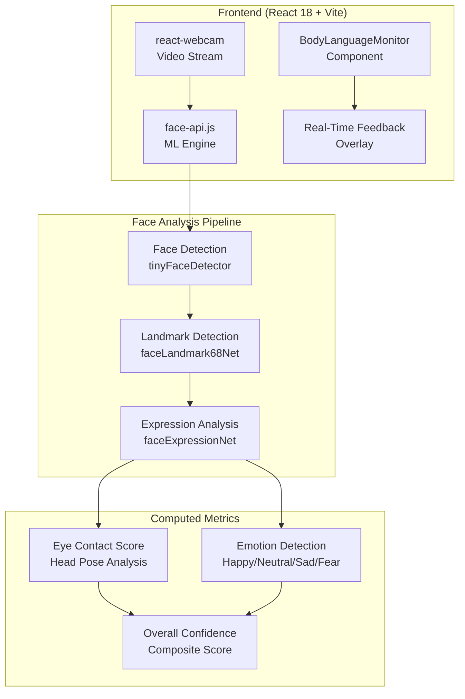
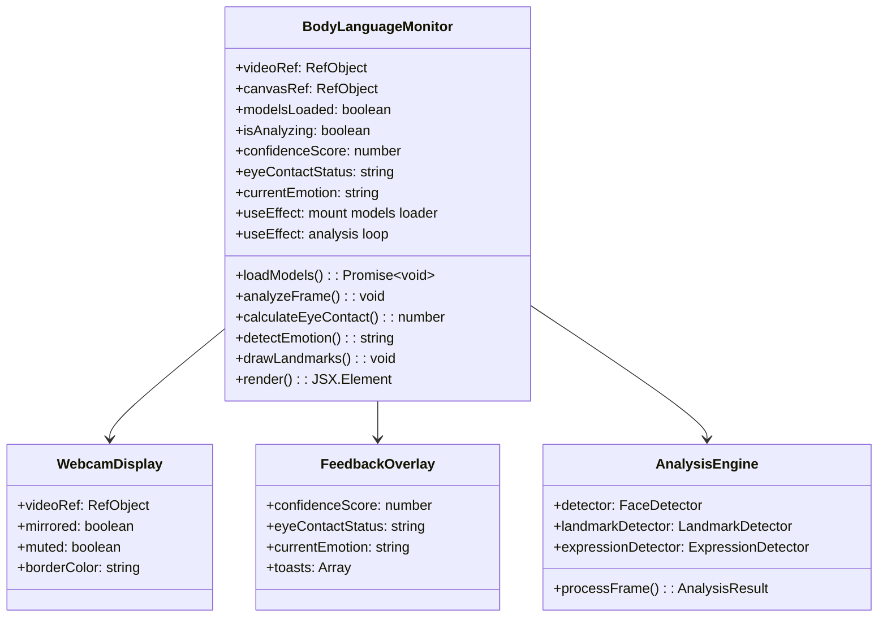

# Real-Time Body Language Analysis Feature Plan

## Project Overview

This document outlines the comprehensive implementation plan for adding a **Real-Time Body Language Analysis** feature to the existing AI-Powered Interview Platform. The feature will analyze the user's webcam feed during mock interviews and provide real-time feedback on eye contact, emotions, and confidence levels.

## 1. Technical Architecture

### 1.1 System Architecture Diagram



### 1.2 Component Architecture



## 2. Required NPM Packages

### 2.1 New Dependencies

| Package | Version | Purpose |
|---------|---------|---------|
| `react-webcam` | ^7.2.0 | Webcam capture and streaming |
| `face-api.js` | ^0.22.2 | Face detection, landmarks, expressions |
| `@mediapipe/face_mesh` | ^0.4.1633559619 | Alternative (optional backup) |

### 2.2 Installation Command

```bash
cd frontend && npm install react-webcam face-api.js
```

### 2.3 Development Dependencies (Optional)

| Package | Version | Purpose |
|---------|---------|---------|
| `@types/react-webcam` | ^0.0.8 | TypeScript support |

## 3. Face-API.js Models

### 3.1 Required Models

The following models need to be downloaded and placed in the `frontend/public/models/` directory:

| Model File | Size | Purpose |
|------------|------|---------|
| `tiny_face_detector_model-weights_manifest.json` | ~5.5MB | Lightweight face detection |
| `face_landmark_68_model-weights_manifest.json` | ~2MB | 68 facial landmarks |
| `face_expression_model-weights_manifest.json` | ~1.5MB | Expression classification |

### 3.2 Model Download Location

**Official GitHub Repository:**
```
https://github.com/justadudewhohacks/face-api.js/tree/master/weights
```

**Direct Download Links:**
- TinyFaceDetector: `https://raw.githubusercontent.com/justadudewhohacks/face-api.js/master/weights/tiny_face_detector_model-weights_manifest.json`
- FaceLandmarks68: `https://raw.githubusercontent.com/justadudewhohacks/face-api.js/master/weights/face_landmark_68_model-weights_manifest.json`
- FaceExpressions: `https://raw.githubusercontent.com/justadudewhohacks/face-api.js/master/weights/face_expression_model-weights_manifest.json`

### 3.3 Model Placement

```
frontend/
├── public/
│   ├── models/
│   │   ├── tiny_face_detector_model-weights_manifest.json
│   │   ├── tiny_face_detector_model-shard1
│   │   ├── face_landmark_68_model-weights_manifest.json
│   │   ├── face_landmark_68_model-shard1
│   │   ├── face_expression_model-weights_manifest.json
│   │   └── face_expression_model-shard1
│   └── vite.svg
```

## 4. BodyLanguageMonitor.jsx Component Design

### 4.1 Component Structure

```jsx
// BodyLanguageMonitor.jsx - Proposed Structure

import React, { useEffect, useRef, useState, useCallback } from 'react';
import Webcam from 'react-webcam';
import * as faceapi from 'face-api.js';
import { motion, AnimatePresence } from 'framer-motion';
import { Card } from './ui/card';

// State Management
const [isInitialized, setIsInitialized] = useState(false);
const [isAnalyzing, setIsAnalyzing] = useState(false);
const [hasPermission, setHasPermission] = useState(null);
const [confidenceScore, setConfidenceScore] = useState(0);
const [eyeContactStatus, setEyeContactStatus] = useState('neutral'); // 'good', 'warning', 'bad'
const [currentEmotion, setCurrentEmotion] = useState('neutral');
const [showToast, setShowToast] = useState(false);
const [toastMessage, setToastMessage] = useState('');
const [toastType, setToastType] = useState('info'); // 'info', 'warning', 'success'
```

### 4.2 Core Functions

#### 4.2.1 Model Loading
```javascript
const loadModels = async () => {
  const MODEL_URL = '/models';
  
  await Promise.all([
    faceapi.nets.tinyFaceDetector.loadFromUri(MODEL_URL),
    faceapi.nets.faceLandmark68Net.loadFromUri(MODEL_URL),
    faceapi.nets.faceExpressionNet.loadFromUri(MODEL_URL),
  ]);
  
  setIsInitialized(true);
};
```

#### 4.2.2 Face Analysis Loop
```javascript
const analyzeFrame = useCallback(async () => {
  if (!videoRef.current || !isInitialized) return;
  
  const video = videoRef.current.video;
  const detections = await faceapi
    .detectSingleFace(video, new faceapi.TinyFaceDetectorOptions())
    .withFaceLandmarks()
    .withFaceExpressions();
  
  if (detections) {
    // Calculate metrics
    const eyeContactScore = calculateEyeContact(detections.landmarks);
    const emotion = detectEmotion(detections.expressions);
    const confidence = calculateConfidence(eyeContactScore, emotion);
    
    // Update state
    updateMetrics(eyeContactScore, emotion, confidence);
  }
  
  // Continue loop
  requestAnimationFrame(analyzeFrame);
}, [isInitialized]);
```

#### 4.2.3 Eye Contact Calculation
```javascript
const calculateEyeContact = (landmarks) => {
  // Get eye landmark positions
  const leftEye = landmarks.getLeftEye();
  const rightEye = landmarks.getRightEye();
  const nose = landmarks.getNose();
  const jaw = landmarks.getJawOutline();
  
  // Calculate head pose angles
  const noseTip = nose[3];
  const leftFaceEdge = jaw[0];
  const rightFaceEdge = jaw[16];
  
  // Determine if looking at camera
  const horizontalRatio = (noseTip.x - leftFaceEdge.x) / (rightFaceEdge.x - leftFaceEdge.x);
  const verticalRatio = (noseTip.y - jaw[0].y) / (jaw[8].y - jaw[0].y);
  
  // Returns 0-100 score
  return calculateScore(horizontalRatio, verticalRatio);
};
```

### 4.3 UI Layout

```jsx
// Main Layout Structure
<div className="relative w-full max-w-md">
  {/* Webcam Container */}
  <div className="relative rounded-2xl overflow-hidden border-4 transition-colors duration-300"
       style={{ borderColor: borderColor }}>
    
    <Webcam
      ref={videoRef}
      mirrored={true}
      muted={true}
      className="w-full h-full object-cover"
    />
    
    {/* Canvas Overlay for Landmarks */}
    <canvas
      ref={canvasRef}
      className="absolute inset-0 w-full h-full"
    />
    
    {/* Glassmorphism Stats Overlay */}
    <div className="absolute top-4 left-4 right-4">
      <GlassmorphismCard>
        <ConfidenceMeter score={confidenceScore} />
        <EyeContactIndicator status={eyeContactStatus} />
        <EmotionBadge emotion={currentEmotion} />
      </GlassmorphismCard>
    </div>
    
    {/* Toast Notifications */}
    <AnimatePresence>
      {showToast && (
        <ToastNotification
          message={toastMessage}
          type={toastType}
        />
      )}
    </AnimatePresence>
  </div>
</div>
```

## 5. Integration with aiInterview.jsx

### 5.1 Integration Points

The BodyLanguageMonitor will be integrated into the User Card section of the interview interface:

```jsx
// Current User Card (lines 481-573 in aiInterview.jsx)
// Replace the AIAvatarSphere with BodyLanguageMonitor

// Current code:
<div className="relative z-10 h-[350px] w-[350px]">
  <AIAvatarSphere status={userSpeaking ? 'active' : 'idle'} type="user" />
</div>

// After integration:
<div className="relative z-10 w-full h-full flex items-center justify-center">
  <BodyLanguageMonitor 
    isActive={isActive}
    onEyeContactChange={handleEyeContactChange}
    onEmotionChange={handleEmotionChange}
    onConfidenceUpdate={handleConfidenceUpdate}
  />
</div>
```

### 5.2 Import Statement

Add at the top of aiInterview.jsx:

```javascript
import BodyLanguageMonitor from './BodyLanguageMonitor';
```

### 5.3 State Sharing (Optional)

If you want to display body language metrics in the header or store them for the final report:

```javascript
// Add to existing state
const [bodyLanguageMetrics, setBodyLanguageMetrics] = useState({
  avgConfidence: 0,
  eyeContactPercentage: 0,
  dominantEmotion: 'neutral',
  warningsCount: 0,
});

// Pass handlers to BodyLanguageMonitor
<BodyLanguageMonitor 
  isActive={isActive}
  onMetricsUpdate={(metrics) => setBodyLanguageMetrics(metrics)}
/>
```

## 6. Edge Cases & Error Handling

### 6.1 Camera Permission Denied

```javascript
const handlePermissionDenied = () => {
  setHasPermission(false);
  // Show fallback UI
  return (
    <div className="flex flex-col items-center justify-center p-8 bg-gray-100 rounded-xl">
      <CameraOffIcon className="w-16 h-16 text-gray-400 mb-4" />
      <p className="text-gray-600 text-center">
        Camera access is required for body language analysis.
        <br />
        Please enable camera permissions in your browser settings.
      </p>
    </div>
  );
};
```

### 6.2 Models Fail to Load

```javascript
const handleModelLoadError = (error) => {
  console.error('Failed to load face-api models:', error);
  // Graceful degradation - show video without analysis
  setIsInitialized(false);
  // Display warning to user
  showToast('Body language analysis unavailable', 'warning');
};
```

### 6.3 No Face Detected

```javascript
const handleNoFaceDetected = () => {
  setEyeContactStatus('neutral');
  setConfidenceScore(prev => Math.max(0, prev - 5)); // Gradual decrease
  // Don't show toast immediately - allow brief moments without detection
};
```

### 6.4 Poor Lighting Conditions

```javascript
const detectPoorLighting = (video) => {
  // Sample pixel values and calculate average brightness
  // If below threshold, show warning toast
};
```

## 7. UI/UX Design Specifications

### 7.1 Color Scheme (Dark Mode Optimized)

| Element | Color | Hex |
|---------|-------|-----|
| Good Status Border | Green | #10B981 |
| Warning Status Border | Amber | #F59E0B |
| Bad Status Border | Red | #EF4444 |
| Glass Background | Semi-transparent dark | rgba(15, 23, 42, 0.8) |
| Glass Border | Subtle white | rgba(255, 255, 255, 0.1) |
| Text Primary | White | #FFFFFF |
| Text Secondary | Gray | #94A3B8 |

### 7.2 Animations

- **Confidence Score**: Smooth number transition (0.3s ease)
- **Status Border**: Color transition (0.5s ease)
- **Toast Entry**: Slide in from top + fade (Framer Motion)
- **Landmarks Drawing**: Real-time canvas rendering at 30fps

### 7.3 Toast Notification Triggers

| Event | Message | Type | Duration |
|-------|---------|------|----------|
| Eye contact lost > 3s | "️ Maintain eye contact" | warning | 2s |
| Good eye contact | " Great confidence!" | success | 1.5s |
| Negative emotion detected | " Try to smile!" | info | 2s |
| Face not centered | " Center your face" | warning | 2s |
| Models loaded | " Analysis ready" | success | 1s |

## 8. Implementation Checklist

### Phase 1: Setup
- [ ] Install npm packages: `react-webcam`, `face-api.js`
- [ ] Download face-api.js models
- [ ] Create `frontend/public/models/` directory
- [ ] Place model files in models directory

### Phase 2: Component Development
- [ ] Create `BodyLanguageMonitor.jsx` component
- [ ] Implement webcam capture with mirror effect
- [ ] Implement model loading logic
- [ ] Implement face detection loop
- [ ] Implement eye contact calculation
- [ ] Implement emotion detection
- [ ] Implement canvas landmark drawing
- [ ] Implement glassmorphism UI overlay
- [ ] Implement toast notification system

### Phase 3: Integration
- [ ] Import BodyLanguageMonitor in aiInterview.jsx
- [ ] Replace User Card avatar with BodyLanguageMonitor
- [ ] Connect isActive prop to analysis loop
- [ ] Test full integration flow

### Phase 4: Polish
- [ ] Add error boundaries
- [ ] Add loading states
- [ ] Optimize (th performancerottle analysis)
- [ ] Test on different browsers
- [ ] Verify dark mode styling

## 9. File Structure After Implementation

```
frontend/
├── public/
│   ├── models/
│   │   ├── tiny_face_detector_model-weights_manifest.json
│   │   ├── tiny_face_detector_model-shard1
│   │   ├── face_landmark_68_model-weights_manifest.json
│   │   ├── face_landmark_68_model-shard1
│   │   ├── face_expression_model-weights_manifest.json
│   │   └── face_expression_model-shard1
│   └── vite.svg
└── src/
    └── components/
        ├── aiInterview.jsx          (modified)
        └── BodyLanguageMonitor.jsx  (new)
```

## 10. Performance Considerations

### 10.1 Optimization Strategies

1. **Detection Interval**: Run face detection every 150ms instead of every frame
2. **Model Selection**: Use TinyFaceDetector for faster processing
3. **Canvas Optimization**: Only redraw when detection results change
4. **Memoization**: Use useCallback and useMemo for expensive computations

### 10.2 Expected Performance

| Metric | Target |
|--------|--------|
| Detection Latency | < 100ms |
| UI Frame Rate | 30fps |
| Memory Usage | < 200MB |
| CPU Usage | < 30% (single core) |

---

## Next Steps

Once this plan is approved, proceed to:

1. **Code Mode**: Implement the `BodyLanguageMonitor.jsx` component
2. **Install Dependencies**: Run npm install commands
3. **Download Models**: Place face-api.js models in public directory
4. **Integrate**: Modify `aiInterview.jsx` to use the new component

---

*Plan Version: 1.0*
*Created: 2026-02-16*
*Target: AI Mock Interview Feature Enhancement*
