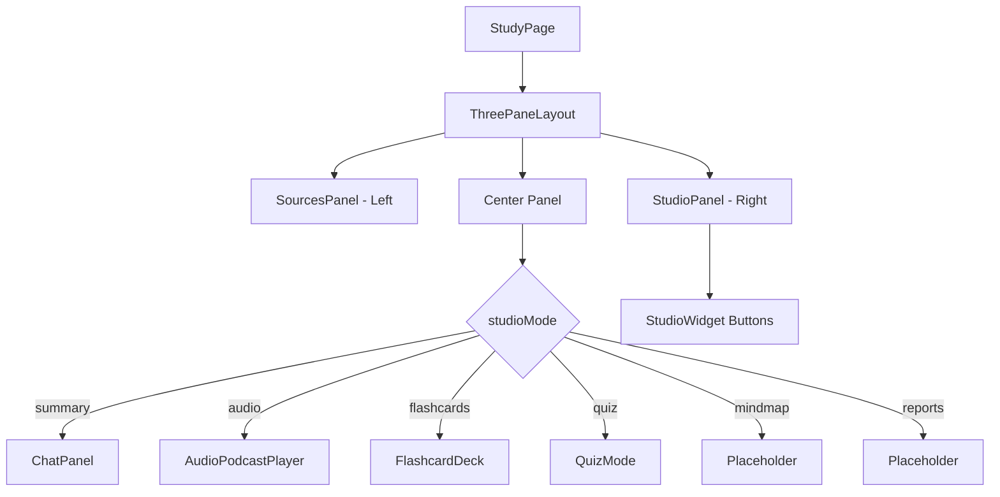

# Study Companion Bug Fixes Plan

## Overview

This plan addresses four bug fixes for the Study Companion feature:

1. **Fix Missing Loading Wave** - Add visual loading state during summary generation
2. **Add Audio Generation Button** - Add manual audio generation trigger
3. **Add Return to Summary Button** - Add navigation back from sub-views
4. **Fix Broken Features** - Debug Mind Map, Report, Infographic, Slide Deck, Data Table

---

## Current Architecture Analysis

### Component Structure



### Key State Variables

- `studioMode` - Current view mode (summary, chat, audio, flashcards, quiz, mindmap, reports, infographic, slides, datatable)
- `studyData` - Contains summary, flashcards, quiz from file processing
- `loading` - Global loading state during file upload
- `isChatMode` - Derived from `studioMode === "summary" || studioMode === "chat"`

---

## Task 1: Fix Missing Loading Wave for Summary Generation

### Problem

When users upload files, the summary is generated but there's no visual LoadingWave animation shown in the summary section of ChatPanel. Users see a blank area while waiting.

### Solution

1. **Add loading state for summary generation** in `StudyPage.jsx`:
   ```javascript
   const [isLoadingSummary, setIsLoadingSummary] = useState(false);
   ```

2. **Pass loading state to ChatPanel**:
   ```jsx
   <ChatPanel
     // ... existing props
     isLoadingSummary={isLoadingSummary}
   />
   ```

3. **Update ChatPanel** to show LoadingWave when `isLoadingSummary` is true and no summary exists yet

### Files to Modify

| File | Changes |
|------|---------|
| `frontend/src/pages/StudyPage.jsx` | Add `isLoadingSummary` state, set true during `handleAddSource`, pass to ChatPanel |
| `frontend/src/components/study/ChatPanel.jsx` | Accept `isLoadingSummary` prop, render LoadingWave in summary section when true |

### Implementation Steps

1. In `StudyPage.jsx`:
   - Add `isLoadingSummary` state variable (line ~19)
   - Set `setIsLoadingSummary(true)` at start of `handleAddSource`
   - Set `setIsLoadingSummary(false)` in finally block of `handleAddSource`
   - Pass `isLoadingSummary={isLoadingSummary}` to ChatPanel

2. In `ChatPanel.jsx`:
   - Accept `isLoadingSummary` prop (default false)
   - Add LoadingWave import
   - Show LoadingWave when `isLoadingSummary` is true and no `studyData.summary` exists

---

## Task 2: Add Audio Generation Button

### Problem

The Audio Overview section currently auto-generates audio when the component mounts. Users cannot manually trigger audio generation, and there's no visual indication of audio existence status.

### Solution

1. **Add state to track audio existence** in `StudyPage.jsx`:
   ```javascript
   const [hasAudio, setHasAudio] = useState(false);
   ```

2. **Add audio generation function** that can be called manually:
   ```javascript
   const handleGenerateAudio = async () => {
     if (!studyData?.summary) return;
     setAudioLoading(true);
     try {
       const response = await axios.post(`${API_BASE}/api/study/audio`, {
         text: studyData.summary
       });
       if (response.status === 200) {
         setHasAudio(true);
       }
     } catch (error) {
       setAudioError(error.message);
     } finally {
       setAudioLoading(false);
     }
   };
   ```

3. **Add "Generate Audio" button** in the Audio Overview header area, visible only when no audio exists

### Files to Modify

| File | Changes |
|------|---------|
| `frontend/src/pages/StudyPage.jsx` | Add `hasAudio`, `audioLoading`, `audioError` states; add `handleGenerateAudio` function; pass to AudioPodcastPlayer |
| `frontend/src/components/study/AudioPodcastPlayer.jsx` | Accept props for manual trigger, show "Generate Audio" button |

### Implementation Steps

1. In `StudyPage.jsx`:
   - Add state: `hasAudio`, `audioLoading`, `audioError`
   - Add `handleGenerateAudio` function that calls `/api/study/audio` endpoint
   - Pass these states to AudioPodcastPlayer via props

2. In `AudioPodcastPlayer.jsx`:
   - Accept `onGenerateAudio`, `isGenerating`, `hasAudio`, `audioError` props
   - Show "Generate Audio" button when `!hasAudio` and `!isGenerating`
   - Display error message if `audioError` exists
   - Show loading spinner while `isGenerating` is true

---

## Task 3: Add 'Return to Summary' Button

### Problem

When users navigate to sub-views (audio, flashcards, quiz, mindmap, etc.), there's no way to return to the original Summary/Chat view except by clicking another studio widget.

### Solution

1. **Add "Back to Summary" button** in the header of non-chat views
2. **Style as secondary ghost button** - transparent background with border
3. **On click**, reset `studioMode` to "summary"

### Files to Modify

| File | Changes |
|------|---------|
| `frontend/src/pages/StudyPage.jsx` | Add `handleReturnToSummary` function |
| `frontend/src/components/study/StudioPanel.jsx` (optional) | Or add directly in StudyPage center panel header |

### Implementation Steps

1. In `StudyPage.jsx`:
   - Add `handleReturnToSummary` function:
     ```javascript
     const handleReturnToSummary = () => {
       setStudioMode("summary");
     };
     ```
   - Add the back button in the center panel header (lines 299-303) for non-chat modes:
     ```jsx
     {!isChatMode && (
       <button
         onClick={handleReturnToSummary}
         className="px-3 py-1.5 text-sm border border-[#e2e8f0] rounded-lg hover:bg-[#f1f5f9] transition-colors"
       >
         ← Back to Summary
       </button>
     )}
     ```

2. Styling:
   - Use ghost/secondary button style: `border border-[#e2e8f0] bg-transparent hover:bg-[#f1f5f9]`
   - Position in header next to the view title

---

## Task 4: Fix Broken Features (Mind Map, Report, etc.)

### Problem Analysis

The features Mind Map, Report, Infographic, Slide Deck, and Data Table are unresponsive. Based on code analysis:

1. **No Backend APIs exist** - There are no `/api/study/mindmap`, `/api/study/reports`, etc. endpoints
2. **Frontend shows "coming soon"** - The `renderCenterContent` function shows placeholder text for these modes
3. **API calls not being made** - The `handleStudioModeChange` only adds activities, doesn't call any APIs

### Two Options for Fix

#### Option A: Fix UI Navigation Only (Minimal Fix)
- Ensure clicking buttons doesn't cause errors
- Improve placeholder handling
- Add proper state management

#### Option B: Full Implementation (Complex)
- Create backend API endpoints for each feature
- Create frontend components to render the data
- This is a significant feature addition

### Recommended: Option A (UI Fix) with preparation for Option B

Given the task says "fix the click handlers" and "debug", I'll implement Option A:

#### Investigation Steps

1. **Check Network Tab** - Verify no API calls are made when clicking these buttons
   - Expected: No calls made (no backend endpoints exist)
   
2. **Verify State Management** - Check `handleStudioModeChange`
   - Current: Updates `studioMode` correctly
   - Issue: No data fetching for these modes

3. **Check Component Rendering** - The placeholder is shown correctly
   - Current: Shows "Mind Map feature coming soon"

#### Fix Implementation

1. **Add proper error handling** - Show user-friendly message when feature unavailable

2. **Add "Generate" buttons** for each feature (similar to audio):
   ```javascript
   // Add state for each feature
   const [featureData, setFeatureData] = useState({
     mindmap: null,
     reports: null,
     infographic: null,
     slides: null,
     datatable: null
   });
   
   const [featureLoading, setFeatureLoading] = useState({
     mindmap: false,
     reports: false,
     // ...
   });
   ```

3. **Create API endpoints** (if Option B chosen later):
   - POST `/api/study/mindmap` - Generate mind map data
   - POST `/api/study/reports` - Generate study reports
   - POST `/api/study/infographic` - Generate infographic
   - POST `/api/study/slides` - Generate slide deck
   - POST `/api/study/datatable` - Generate data table

### Files to Modify (Option A)

| File | Changes |
|------|---------|
| `frontend/src/pages/StudyPage.jsx` | Add feature states, improve placeholder rendering, add generate buttons |
| `frontend/src/components/study/StudioPanel.jsx` | (Optional) Add visual indicators for unavailable features |

### Implementation Steps

1. In `StudyPage.jsx`:
   - Add feature loading/error states
   - Modify `renderCenterContent` to show "Generate [Feature]" buttons instead of just "coming soon"
   - Add handler functions for generating each feature type
   - These will call placeholder API endpoints (which can return mock data for now)

2. Add placeholder API routes in backend:
   ```javascript
   // In backend/routes/studyRoutes.js
   router.post("/mindmap", async (req, res) => {
     // Return mock mind map data for now
     res.json({ success: true, data: { nodes: [], edges: [] } });
   });
   ```

---

## Summary: Files to Modify

| # | File | Tasks |
|---|------|-------|
| 1 | `frontend/src/pages/StudyPage.jsx` | Tasks 1, 2, 3, 4 - Add all new states and handlers |
| 2 | `frontend/src/components/study/ChatPanel.jsx` | Task 1 - Accept isLoadingSummary prop, show LoadingWave |
| 3 | `frontend/src/components/study/AudioPodcastPlayer.jsx` | Task 2 - Accept audio generation props, show button |
| 4 | `backend/routes/studyRoutes.js` | Task 4 - Add placeholder endpoints for features |

---

## Implementation Order

1. **Task 1** - Loading Wave (simplest, low risk)
2. **Task 3** - Return to Summary Button (simple navigation fix)
3. **Task 2** - Audio Generation Button (moderate complexity)
4. **Task 4** - Broken Features (most complex, requires decision on scope)

---

## Notes

- All changes are backward compatible
- Existing functionality is preserved
- New features gracefully degrade if backend endpoints don't exist
- Loading states prevent double-submissions
- Error states provide user feedback
