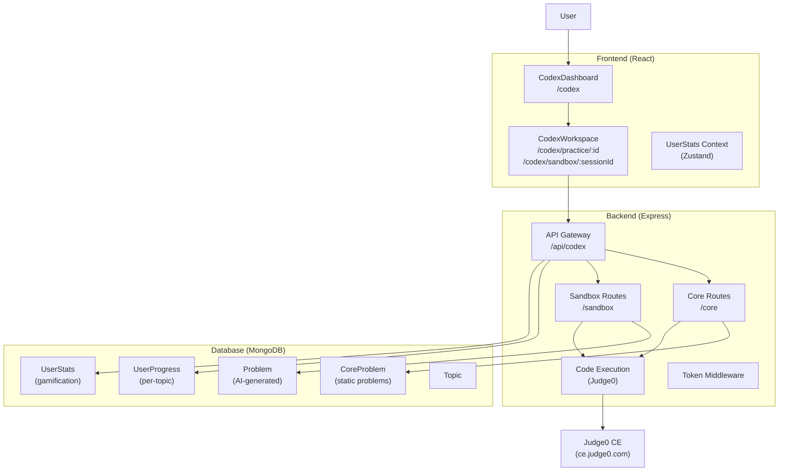

# Codex Platform Redesign - Execution Plan

> **Architecture Version:** 2.0  
> **Date:** 2026-03-01  
> **Status:** Ready for Review

---

## Overview

This plan transforms the existing Codex implementation from a simple AI proxy into a full-fledged coding practice platform with:
- **Core Curriculum**: Static problems with deterministic test cases
- **AI Sandbox**: Dynamic problem generation with token-based access
- **Gamification**: Streaks, tokens, and activity heatmaps

---

## System Architecture Diagram



---

## Phase 1: Database Schema Updates

### 1.1 Create `CoreProblem` Model

**File:** `backend/models/CoreProblem.js`

```javascript
import mongoose from "mongoose";

const CoreProblemSchema = new mongoose.Schema({
  title: { type: String, required: true },
  topic: { type: mongoose.Schema.Types.ObjectId, ref: "Topic", required: true },
  difficulty: { type: String, enum: ["easy", "medium", "hard"], required: true },
  description: { type: String, required: true },
  constraints: { type: String, default: "" },
  starterCode: {
    python: { type: String, default: "" },
    javascript: { type: String, default: "" },
    cpp: { type: String, default: "" },
    java: { type: String, default: "" }
  },
  testCases: [{
    input: { type: String, required: true },      // Hidden from user
    expectedOutput: { type: String, required: true }, // Hidden from user
    isHidden: { type: Boolean, default: true }
  }],
  createdBy: { type: String, default: "admin" },
  isPublished: { type: Boolean, default: false }
}, { timestamps: true });

export default mongoose.model("CoreProblem", CoreProblemSchema);
```

### 1.2 Update `UserProgress` Model

**File:** `backend/models/UserProgress.js`

**Changes:**
- Add fields for Core problem tracking
- Add execution metrics

```javascript
// Add to existing schema
coreProgress: [{
  problemId: { type: mongoose.Schema.Types.ObjectId, ref: "CoreProblem" },
  status: { type: String, enum: ["attempted", "solved"], default: "attempted" },
  executionTime: { type: Number, default: 0 },    // ms
  memoryUsed: { type: Number, default: 0 },        // KB
  solvedAt: { type: Date }
}],
lastAttemptAt: { type: Date }
```

### 1.3 Create `UserStats` Model (Gamification)

**File:** `backend/models/UserStats.js`

```javascript
import mongoose from "mongoose";

const UserStatsSchema = new mongoose.Schema({
  userId: { 
    type: mongoose.Schema.Types.ObjectId, 
    ref: "User", 
    required: true,
    unique: true 
  },
  tokens: { type: Number, default: 100 },         // Starting tokens
  totalTokensSpent: { type: Number, default: 0 },
  totalTokensEarned: { type: Number, default: 0 },
  
  // Streak tracking
  currentStreak: { type: Number, default: 0 },
  longestStreak: { type: Number, default: 0 },
  lastActiveDate: { type: Date },
  
  // Activity heatmap (GitHub-style)
  dailyActivityMap: {
    type: Map,
    of: {
      problemsSolved: { type: Number, default: 0 },
      tokensEarned: { type: Number, default: 0 }
    },
    default: new Map()
  },
  
  // Problem type counts
  coreProblemsSolved: { type: Number, default: 0 },
  sandboxProblemsAttempted: { type: Number, default: 0 }
}, { timestamps: true });

export default mongoose.model("UserStats", UserStatsSchema);
```

### 1.4 Update `User` Model (Optional Token Field)

**File:** `backend/models/userModel.js`

Add quick reference to stats:
```javascript
stats: { type: mongoose.Schema.Types.ObjectId, ref: "UserStats" }
```

---

## Phase 2: Backend API Routes

### 2.1 Create Core Curriculum Routes

**File:** `backend/routes/codexCoreRoutes.js`

#### GET `/api/codex/core`
- **Purpose:** Fetch list of static problems for dashboard
- **Auth:** Required
- **Query Params:** `topicId?`, `difficulty?`, `status?` (solved/unsolved)
- **Response:**
```json
{
  "problems": [
    {
      "_id": "...",
      "title": "Two Sum",
      "topic": { "_id": "...", "name": "Arrays" },
      "difficulty": "easy",
      "status": "unsolved" // from user's progress
    }
  ],
  "total": 150,
  "solved": 23
}
```

#### GET `/api/codex/core/:id`
- **Purpose:** Fetch full problem details with starter code
- **Auth:** Required
- **Response:**
```json
{
  "_id": "...",
  "title": "Two Sum",
  "description": "...",
  "constraints": "...",
  "starterCode": { "python": "...", "javascript": "..." },
  "difficulty": "easy",
  "topic": { "_id": "...", "name": "Arrays" }
}
```

#### POST `/api/codex/core/submit`
- **Purpose:** Run code against hidden test cases
- **Auth:** Required
- **Body:**
```json
{
  "problemId": "...",
  "code": "def solution(nums, target): ...",
  "language": "python"
}
```
- **Logic:**
  1. Fetch CoreProblem with test cases
  2. Execute code via Judge0 for each test case
  3. Compare output with expected
  4. Update UserProgress if all pass
  5. Update UserStats streak if first success
- **Response:**
```json
{
  "success": true,
  "passed": 5,
  "total": 5,
  "executionTime": 45,
  "memoryUsed": 1024,
  "testResults": [
    { "testCase": 1, "passed": true, "input": "...", "output": "...", "expected": "..." }
  ]
}
```

### 2.2 Refactor Sandbox Routes (Token Integration)

**File:** `backend/routes/codexAiRoutes.js`

#### POST `/api/codex/sandbox/generate`
- **Update:** Add token deduction
- **Logic:**
  1. Check UserStats for token balance
  2. If tokens < cost (e.g., 5), return 402
  3. Deduct tokens, increment totalTokensSpent
  4. Generate problem (existing logic)
  5. Save to Problem collection

#### POST `/api/codex/sandbox/submit`
- **Update:** Track sandbox usage in UserStats

### 2.3 User Stats Routes

**File:** `backend/routes/codexStatsRoutes.js`

```javascript
// GET /api/codex/stats
// Returns user's gamification data

// POST /api/codex/stats/daily
// Called when user solves a problem (updates streak & heatmap)
```

### 2.4 Register New Routes

**File:** `backend/main.js`

```javascript
import codexCoreRoutes from "./routes/codexCoreRoutes.js";
import codexStatsRoutes from "./routes/codexStatsRoutes.js";

// Add after existing codex routes
app.use("/api/codex/core", codexCoreRoutes);
app.use("/api/codex/stats", codexStatsRoutes);
```

---

## Phase 3: Frontend Routing & State

### 3.1 Add New Routes

**File:** `frontend/src/App.jsx`

```javascript
import CodexDashboard from "./components/codex/CodexDashboard";
import CodexWorkspace from "./components/codex/CodexWorkspace";

// Add routes
<Route path="/codex" element={<CodexDashboard />} />
<Route path="/codex/practice/:problemId" element={<CodexWorkspace type="core" />} />
<Route path="/codex/sandbox/:sessionId" element={<CodexWorkspace type="sandbox" />} />
```

### 3.2 Create UserStats Store (Zustand)

**File:** `frontend/src/store/useUserStatsStore.js`

```javascript
import { create } from 'zustand';

const useUserStatsStore = create((set) => ({
  tokens: 100,
  currentStreak: 0,
  longestStreak: 0,
  dailyActivityMap: {},
  coreProblemsSolved: 0,
  
  // Actions
  fetchStats: async () => { /* fetch from /api/codex/stats */ },
  deductTokens: (amount) => set((state) => ({ tokens: state.tokens - amount })),
  updateStreak: (streakData) => set({ 
    currentStreak: streakData.currentStreak,
    longestStreak: streakData.longestStreak 
  }),
  incrementSolved: () => set((state) => ({ 
    coreProblemsSolved: state.coreProblemsSolved + 1 
  })),
}));

export default useUserStatsStore;
```

### 3.3 Update API Client

**File:** `frontend/src/components/api.js`

```javascript
/* ---------------- CORE PROBLEMS ---------------- */

export const fetchCoreProblems = async (params = {}) => {
  const res = await api.get("/codex/core", { params });
  return res.data;
};

export const fetchCoreProblem = async (id) => {
  const res = await api.get(`/api/codex/core/${id}`);
  return res.data;
};

export const submitCoreSolution = async ({ problemId, code, language }) => {
  const res = await api.post("/api/codex/core/submit", {
    problemId, code, language
  });
  return res.data;
};

/* ---------------- USER STATS ---------------- */

export const fetchUserStats = async () => {
  const res = await api.get("/api/codex/stats");
  return res.data;
};

export const updateDailyActivity = async () => {
  const res = await api.post("/api/codex/stats/daily");
  return res.data;
};

/* ---------------- SANDBOX (Updated) ---------------- */

export const generateProblem = async ({ topicId, difficulty }) => {
  // Now includes token deduction
  const res = await api.post("/codex/ai/generate", {
    topicId, difficulty
  });
  return res.data;
};
```

---

## Phase 4: CodexDashboard Component

### 4.1 Create Dashboard Layout

**File:** `frontend/src/components/codex/CodexDashboard.jsx`

```javascript
// Structure
const CodexDashboard = () => {
  const [activeTab, setActiveTab] = useState("core"); // "core" | "sandbox"
  const { tokens, currentStreak, fetchStats } = useUserStatsStore();
  
  // Load stats on mount
  useEffect(() => { fetchStats(); }, []);
  
  return (
    <div className="min-h-screen bg-gray-50 p-6">
      {/* Header */}
      <header className="flex justify-between items-center mb-6">
        <h1 className="text-2xl font-bold">Codex</h1>
        <div className="flex gap-4">
          <div className="flex items-center gap-2">
            <FlameIcon className="text-orange-500" />
            <span>{currentStreak} day streak</span>
          </div>
          <div className="flex items-center gap-2">
            <TokenIcon className="text-yellow-500" />
            <span>{tokens} tokens</span>
          </div>
        </div>
      </header>
      
      {/* Tabs */}
      <Tabs value={activeTab} onChange={setActiveTab}>
        <Tab value="core" label="Core Curriculum" />
        <Tab value="sandbox" label="AI Sandbox" />
      </Tabs>
      
      {/* Content */}
      {activeTab === "core" ? <CoreTab /> : <SandboxTab />}
    </div>
  );
};
```

### 4.2 Core Tab Component

**File:** `frontend/src/components/codex/CoreTab.jsx`

- Fetches problems via `fetchCoreProblems()`
- Displays data table with columns: Status, Title, Topic, Difficulty
- Includes filters: Topic dropdown, Difficulty dropdown, Status toggle
- Clicking a row navigates to `/codex/practice/:id`

### 4.3 Sandbox Tab Component

**File:** `frontend/src/components/codex/SandboxTab.jsx`

- Form with: Target Company, Topic, Difficulty
- On submit:
  1. Check token balance (show warning if < 5)
  2. Call `generateProblem()` 
  3. Deduct tokens from store
  4. Navigate to `/codex/sandbox/:problemId`

### 4.4 Heatmap Component

**File:** `frontend/src/components/codex/ActivityHeatmap.jsx`

- Renders 30-day contribution graph
- Fetches data from `UserStats.dailyActivityMap`
- Color intensity based on problems solved

---

## Phase 5: CodexWorkspace Component

### 5.1 Refactor Existing Codex

**File:** `frontend/src/components/codex/CodexWorkspace.jsx`

```javascript
const CodexWorkspace = ({ type }) => { // type: "core" | "sandbox"
  const { problemId } = useParams();
  const navigate = useNavigate();
  const { tokens, incrementSolved } = useUserStatsStore();
  
  // Fetch problem based on type
  useEffect(() => {
    if (type === "core") {
      fetchCoreProblem(problemId).then(setProblem);
    } else {
      fetchSandboxProblem(problemId).then(setProblem);
    }
  }, [problemId, type]);
  
  // Update handleRun to check problem type
  const handleRun = async () => {
    if (type === "core") {
      const result = await submitCoreSolution({
        problemId,
        code,
        language
      });
      if (result.success) {
        incrementSolved();
        // Show success modal
      }
      setOutput(result);
    } else {
      // Sandbox: existing executeCode + analyzeCode
      const execResult = await executeCode(language, code);
      setOutput(execResult);
    }
  };
  
  return (
    <div className="flex h-screen">
      {/* Left: Read-only Problem Panel */}
      <div className="w-2/5 p-2">
        <ProblemPanel problem={problem} readOnly={true} />
      </div>
      
      {/* Right: Editor + Output */}
      <div className="w-3/5 flex flex-col p-2">
        <EditorPanel code={code} ... />
        <OutputPanel output={output} ... />
      </div>
    </div>
  );
};
```

### 5.2 ProblemPanel Updates

**File:** `frontend/src/components/codex/ProblemPanel.jsx`

- Add `readOnly` prop
- When readOnly=true: Hide topic/difficulty selectors, hide Generate button
- Keep Description/Examples/Constraints tabs

---

## Implementation Order

| Phase | Task | Priority |
|-------|------|----------|
| 1 | Create CoreProblem model | P0 |
| 1 | Create UserStats model | P0 |
| 1 | Update UserProgress model | P1 |
| 2 | Implement Core routes (list, detail, submit) | P0 |
| 2 | Implement Stats routes | P1 |
| 2 | Update Sandbox routes with token middleware | P1 |
| 3 | Create Zustand store | P0 |
| 3 | Update App.jsx routes | P0 |
| 3 | Update API client | P0 |
| 4 | Create CodexDashboard | P0 |
| 4 | Create Heatmap component | P2 |
| 5 | Refactor CodexWorkspace | P0 |
| 5 | Update ProblemPanel | P1 |

---

## Key Decisions & Trade-offs

| Decision | Rationale |
|----------|-----------|
| Use Judge0 CE (existing) | Already integrated, free tier sufficient for MVP |
| Store CoreProblems separately | Clear separation between static/AI content |
| Zustand for state | Lightweight, simpler than Redux for this use case |
| Token deduction on generate | Simple monetization model to implement first |

---

## Next Steps

Once you approve this plan, we can begin implementation in **Code mode**. I'll start with:

1. Creating the database models
2. Setting up the backend routes
3. Building the frontend components

Would you like me to make any adjustments to this plan?
