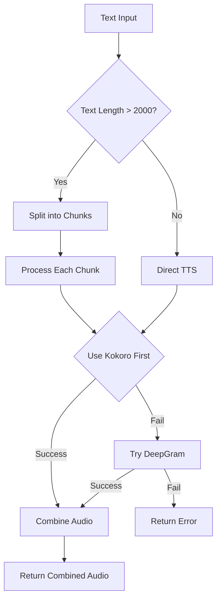

# Plan: Kokoro TTS Integration with Chunking + DeepGram Fallback

## Problem Statement
- DeepGram TTS has a **2000 character limit** for text input
- Audio summaries exceed this limit, causing `Payload Too Large` errors
- Need to deploy on **Render free tier** (with cold start limitations)

## Solution Architecture



---

## Implementation Steps

### Phase 1: Update Environment Variables
- Add `HUGGING_FACE_API_KEY` to `.env` (free tier: 1000 credits/month)
- Keep `DEEPGRAM_API_KEY` as fallback

### Phase 2: Modify Audio Service
**File:** [`backend/services/audio.service.js`](backend/services/audio.service.js)

1. **Add Hugging Face client**
   - Install: `npm install @huggingface/inference`
   - Import and configure client

2. **Add text chunking logic**
   - Split text at sentence boundaries
   - Max chunk size: 1500 chars (leaving buffer)
   - Preserve sentence integrity

3. **Implement Kokoro TTS function**
   - Use `Kokoro` model via Hugging Face Inference API
   - Handle API responses and errors

4. **Add audio concatenation**
   - Combine multiple audio chunks into single buffer
   - Ensure smooth transitions

5. **Implement fallback chain**
   - Primary: Kokoro TTS (Hugging Face)
   - Fallback: DeepGram TTS
   - Error handling for both

### Phase 3: Update Study Routes (if needed)
**File:** [`backend/routes/studyRoutes.js`](backend/routes/studyRoutes.js)

- Verify error handling passes correct messages
- No major changes expected

### Phase 4: Deployment Considerations for Render Free Tier

| Issue | Solution |
|-------|----------|
| Cold starts (15+ min idle) | Implement audio caching (already exists) |
| Limited compute | Use lightweight models, cache aggressively |
| Memory limits (512MB) | Stream audio chunks, don't buffer all in memory |
| API rate limits | Hugging Face free tier: 1000 req/month |

---

## Technical Details

### Text Chunking Algorithm
```
1. If text.length <= 1500 → return single chunk
2. Split text by '.', '!', '?' (sentence boundaries)
3. Accumulate sentences until chunk reaches ~1400 chars
4. If single sentence > 1400 chars → hard split at 1400
5. Return array of chunks
```

### API Integration
- **Kokoro TTS**: `https://api-inference.huggingface.co/models/kokoro`
- **Audio Format**: Will output WAV, convert to MP3 if needed
- **Chunk Processing**: Sequential, combine results

---

## Files to Modify
1. `backend/.env` - Add Hugging Face API key
2. `backend/package.json` - Add `@huggingface/inference` dependency
3. `backend/services/audio.service.js` - Main implementation
4. `backend/routes/studyRoutes.js` - Minor error handling updates (if needed)

---

## Estimated API Costs
- **Hugging Face Free Tier**: 1000 credits/month
- **DeepGram**: Keep existing (~$0.004/min generated)
- **Total**: Free for typical usage (< 1000 summaries/month)

---

## Risk Mitigation
| Risk | Mitigation |
|------|------------|
| Hugging Face API down | Fallback to DeepGram |
| Text too long even with chunking | Limit input to 10,000 chars |
| Memory issues on Render | Stream chunks, use buffers |
| Cold start delays | Aggressive caching strategy |

---

## Next Steps (After Approval)
1. Switch to Code mode
2. Add Hugging Face dependency
3. Update audio.service.js with new implementation
4. Test locally
5. Deploy to Render
