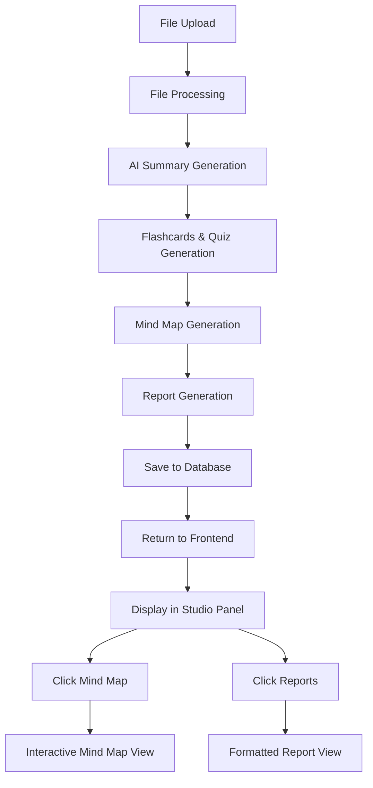

# Mind Map & Reports Auto-Generation Implementation Plan

## Overview

This plan outlines the implementation to auto-generate Mind Map and Reports after uploading study resources in the Study Companion. Currently, the system generates Summary, Flashcards, and Quiz automatically, but Mind Map and Reports are placeholder endpoints returning mock data.

---

## Current State Analysis

### Existing Components
1. **FileUpload Flow**: [`FileUploader.jsx`](frontend/src/components/study/FileUploader.jsx) → `/api/study/process` → generates summary/flashcards/quiz
2. **StudioPanel**: Has Mind Map and Reports buttons in the widget grid
3. **StudyPage**: Has feature generation handlers for mindmap, reports, infographic, slides, datatable
4. **Backend Routes**: [`studyRoutes.js`](backend/routes/studyRoutes.js) has placeholder `/mindmap` and `/reports` endpoints returning mock data
5. **StudySession Model**: Stores session data but no mindmap/report fields

---

## Implementation Architecture



---

## Implementation Steps

### Phase 1: Backend - Model Updates

#### 1.1 Update StudySession Model
**File**: [`backend/models/StudySession.js`](backend/models/StudySession.js)

Add new fields to store generated mind map and report:

```javascript
mindmap: {
  type: Object, // Stores { nodes: [], edges: [] }
  default: null,
},
report: {
  type: Object, // Stores { title, sections: [], generatedAt }
  default: null,
},
```

---

### Phase 2: Backend - AI Service Functions

#### 2.1 Create generateMindMap Function
**File**: [`backend/services/studyAI.service.js`](backend/services/studyAI.service.js)

Add new function to generate mind map data:

```javascript
export const generateMindMap = async (rawText) => {
  // Prompt AI to generate hierarchical node structure
  // Return { nodes: [{ id, label, x, y, parentId }], edges: [{ from, to }] }
}
```

**Output Format**:
- Nodes: `[{ id, label, x, y, parentId, level }]`
- Edges: `[{ from, to }]`

#### 2.2 Create generateReport Function
**File**: [`backend/services/studyAI.service.js`](backend/services/studyAI.service.js)

Add new function to generate study report:

```javascript
export const generateReport = async (rawText) => {
  // Prompt AI to generate structured report
  // Return { title, summary, sections: [{ heading, content }], keyPoints, generatedAt }
}
```

**Output Format**:
- `title`: String
- `summary`: String (brief overview)
- `sections`: `[{ heading, content }]`
- `keyPoints`: Array of strings

---

### Phase 3: Backend - Route Updates

#### 3.1 Update /process Endpoint
**File**: [`backend/routes/studyRoutes.js`](backend/routes/studyRoutes.js)

Modify the `/api/study/process` endpoint to auto-generate mind map and report:

```javascript
// After generating flashcards/quiz
const mindmap = await generateMindMap(combinedText);
const report = await generateReport(combinedText);

// Save to database
const studySession = new StudySession({
  sessionId,
  files: parsedFiles,
  combinedText,
  summary: studyData.summary,
  flashcards: studyData.flashcards,
  quiz: studyData.quiz,
  mindmap,
  report,
  chatHistory: [],
});
```

#### 3.2 Update /mindmap Endpoint
**File**: [`backend/routes/studyRoutes.js`](backend/routes/studyRoutes.js)

Replace mock implementation with real AI generation:

```javascript
router.post("/mindmap", async (req, res) => {
  try {
    const { text, sessionId } = req.body;
    
    // Get text from session or body
    let studyText = text;
    if (sessionId && !text) {
      const session = await StudySession.findOne({ sessionId });
      studyText = session?.combinedText;
    }
    
    const mindmap = await generateMindMap(studyText);
    res.json({ success: true, data: mindmap });
  } catch (error) {
    res.status(500).json({ success: false, message: error.message });
  }
});
```

#### 3.3 Update /reports Endpoint
**File**: [`backend/routes/studyRoutes.js`](backend/routes/studyRoutes.js)

Replace mock implementation with real AI generation:

```javascript
router.post("/reports", async (req, res) => {
  try {
    const { text, sessionId } = req.body;
    
    let studyText = text;
    if (sessionId && !text) {
      const session = await StudySession.findOne({ sessionId });
      studyText = session?.combinedText;
    }
    
    const report = await generateReport(studyText);
    res.json({ success: true, data: report });
  } catch (error) {
    res.status(500).json({ success: false, message: error.message });
  }
});
```

---

### Phase 4: Frontend - Mind Map Visualization

#### 4.1 Install React Flow (or similar)
**File**: [`frontend/package.json`](frontend/package.json)

Add dependency:
```json
"@xyflow/react": "^12.0.0"
```

#### 4.2 Create MindMapViewer Component
**New File**: [`frontend/src/components/study/MindMapViewer.jsx`](frontend/src/components/study/MindMapViewer.jsx)

Create interactive mind map visualization:
- Display nodes as connected circles/rectangles
- Handle pan/zoom
- Show labels on nodes
- Color-code by hierarchy level

#### 4.3 Update StudyPage Integration
**File**: [`frontend/src/pages/StudyPage.jsx`](frontend/src/pages/StudyPage.jsx)

Update to handle mind map from initial upload:
- Check if `studyData.mindmap` exists
- Pass to MindMapViewer component for rendering

---

### Phase 5: Frontend - Report Display

#### 5.1 Create ReportViewer Component
**New File**: [`frontend/src/components/study/ReportViewer.jsx`](frontend/src/components/study/ReportViewer.jsx)

Create structured report display:
- Title header
- Summary section
- Accordion-style sections
- Key points highlight box

#### 5.2 Update StudyPage Integration
**File**: [`frontend/src/pages/StudyPage.jsx`](frontend/src/pages/StudyPage.jsx)

Update to handle report from initial upload:
- Check if `studyData.report` exists
- Pass to ReportViewer component for rendering

---

### Phase 6: Testing & Refinement

#### 6.1 Test Upload Flow
- Upload PDF/document
- Verify mind map auto-generates
- Verify report auto-generates
- Check database persistence

#### 6.2 Test On-Demand Generation
- Click Mind Map button without prior upload
- Click Reports button without prior upload
- Verify generation works

#### 6.3 UI/UX Improvements
- Loading states during generation
- Error handling and user feedback
- Responsive design for mind map

---

## File Changes Summary

### New Files to Create
| File | Purpose |
|------|---------|
| `frontend/src/components/study/MindMapViewer.jsx` | Interactive mind map visualization |
| `frontend/src/components/study/ReportViewer.jsx` | Structured report display |

### Files to Modify
| File | Changes |
|------|---------|
| `backend/models/StudySession.js` | Add mindmap and report fields |
| `backend/services/studyAI.service.js` | Add generateMindMap and generateReport functions |
| `backend/routes/studyRoutes.js` | Update endpoints with real AI generation |
| `frontend/src/pages/StudyPage.jsx` | Integrate MindMapViewer and ReportViewer |
| `frontend/package.json` | Add @xyflow/react dependency |

---

## Acceptance Criteria

1. ✅ After file upload, mind map is auto-generated and saved
2. ✅ After file upload, report is auto-generated and saved
3. ✅ Clicking "Mind Map" shows interactive node-based visualization
4. ✅ Clicking "Reports" shows formatted report with sections
5. ✅ Data persists in database for session
6. ✅ On-demand generation still works if not auto-generated
7. ✅ Loading states shown during generation
8. ✅ Error handling for failed generations
