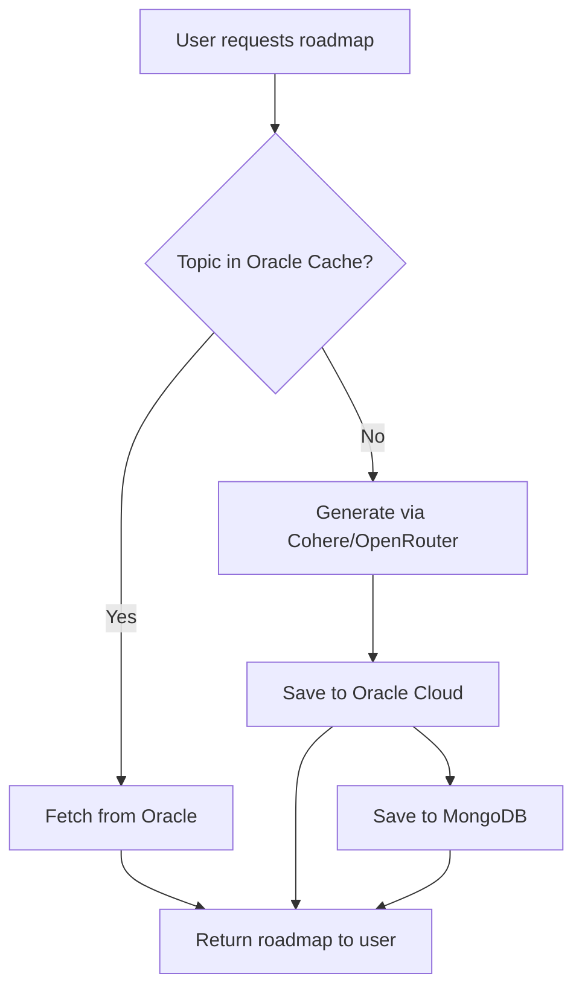

# Oracle Cloud Roadmap Caching Implementation Plan

## Overview
Implement a caching layer using Oracle Cloud Object Storage to cache generated roadmaps. This will reduce API costs by avoiding redundant roadmap generation when the same topic is requested multiple times.

## Architecture

```
┌─────────────────┐     ┌──────────────────┐     ┌─────────────────────┐
│   Frontend      │────▶│  Backend API     │────▶│  Oracle Cloud       │
│  (roadmap.jsx)  │     │  (roadmapRoute)  │     │  Object Storage     │
└─────────────────┘     └──────────────────┘     └─────────────────────┘
                              │                            │
                              │                            │
                        ┌─────▼─────┐              ┌──────▼──────┐
                        │  MongoDB  │              │  Cache Hit  │
                        │ (Primary) │              │  or Miss    │
                        └───────────┘              └─────────────┘
```

## Cache Flow



## Implementation Steps

### Step 1: Create Oracle Cloud Roadmap Cache Service
**File:** `backend/services/oracleRoadmapCache.js`

Create a new service file with functions:
- `getRoadmapFromOracle(topic)` - Fetch cached roadmap
- `saveRoadmapToOracle(topic, roadmap)` - Store roadmap in Oracle
- `generateCacheKey(topic)` - Generate normalized cache key
- `isRoadmapExpired(metadata)` - Check if cache is stale

### Step 2: Update Roadmap Route to Implement Cache-First Logic
**File:** `backend/routes/roadmapRoute.js`

Modify existing `POST /add` endpoint:
1. Check Oracle Cloud cache first using normalized topic
2. If cache hit → return cached roadmap (skip AI generation)
3. If cache miss → generate new roadmap via AI
4. After generation → save to Oracle Cloud AND MongoDB

Add new `GET /:topic` endpoint:
1. Accept optional query param: `?level=beginner|intermediate|advanced`
2. Fetch from Oracle cache
3. Return full roadmap or filtered level

### Step 3: Add Cache Metadata
**File:** `backend/models/roadmapModel.js`

Extend roadmap to include cache metadata:
```javascript
cacheMetadata: {
    cachedAt: Date,
    oracleKey: String,
    expiresAt: Date,
    hitCount: { type: Number, default: 0 }
}
```

### Step 4: Update Frontend
**File:** `frontend/src/components/roadmap.jsx`

- Update to use GET endpoint
- Add level selection dropdown (optional)
- Show "Loaded from cache" indicator

## Cache Key Strategy

| Topic Input | Normalized Key | Oracle Object Key |
|-------------|----------------|-------------------|
| "Python" | `python` | `roadmaps/python.json` |
| "Machine Learning" | `machine-learning` | `roadmaps/machine-learning.json` |
| "  React.js  " | `reactjs` | `roadmaps/reactjs.json` |

## File Structure Changes

```
backend/
├── services/
│   └── oracleRoadmapCache.js  [NEW]
├── routes/
│   └── roadmapRoute.js       [MODIFY]
└── models/
    └── roadmapModel.js       [MODIFY]

frontend/src/components/
└── roadmap.jsx              [MODIFY]
```

## Error Handling

1. **Oracle Cloud Unavailable**: Fall back to MongoDB → Generate new if not found
2. **Cache Expired**: Re-generate roadmap and update cache
3. **Network Errors**: Log error, proceed with generation

## Environment Variables

No new environment variables required. Uses existing:
- `ORACLE_ENDPOINT`
- `ORACLE_REGION`
- `ORACLE_ACCESS_KEY_ID`
- `ORACLE_SECRET_ACCESS_KEY`
- `ORACLE_BUCKET`

## Expected Benefits

1. **Reduced API Costs**: Same topic requested multiple times → single AI generation
2. **Faster Response**: Cache hit returns in ~100ms vs ~3-5s for AI generation
3. **Load Reduction**: Fewer calls to Cohere/OpenRouter APIs

## Testing Checklist

- [ ] Generate roadmap for "Python" → stored in Oracle
- [ ] Request "Python" again → returns cached version (verify via logs)
- [ ] Request "python" (lowercase) → returns cached version
- [ ] Request "  Python  " (with spaces) → returns cached version
- [ ] Request new topic "JavaScript" → generates new roadmap
- [ ] Oracle Cloud unavailable → falls back to MongoDB/generation
- [ ] Frontend displays roadmap correctly from cache
