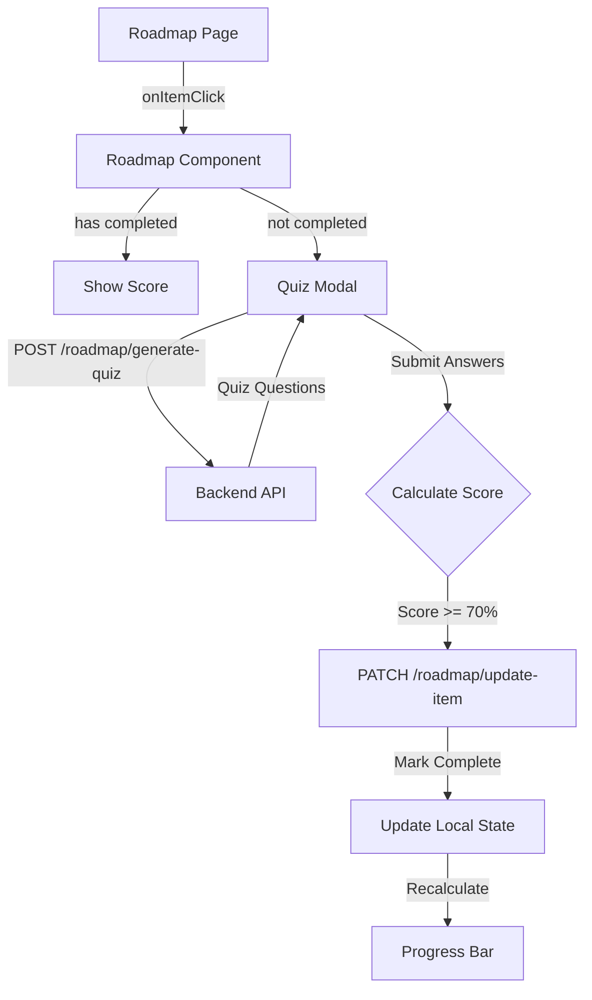

# Roadmap Progress Tracking & Quiz Feature Plan

## Overview
Add progress tracking and interactive quiz elements to the roadmap feature. Users can take quizzes on roadmap items, track completion progress, and view scores.

---

## System Architecture



---

## Implementation Steps

### Phase 1: Backend Changes

#### Step 1: Update Roadmap Model
- **File**: `backend/models/roadmapModel.js`
- Add optional fields to item schema:
  - `completed: { type: Boolean, default: false }`
  - `quizScore: { type: Number, default: null }`

#### Step 2: Create Quiz Generation Endpoint
- **File**: `backend/routes/roadmapRoute.js`
- **Endpoint**: `POST /roadmap/generate-quiz`
- **Request Body**: `{ topic: string, itemKey: string, level: string }`
- **Response**: `{ success: true, questions: [...] }`
- Generate 3 questions per item using AI (re-use quiz generation logic)

#### Step 3: Create Update Item Endpoint
- **File**: `backend/routes/roadmapRoute.js`
- **Endpoint**: `PATCH /roadmap/update-item`
- **Request Body**: `{ topic: string, level: string, itemIndex: number, completed: boolean, quizScore: number }`
- **Response**: `{ success: true, updatedItem: {...} }`
- Update the item in MongoDB and Oracle cache

---

### Phase 2: Frontend - Roadmap Component

#### Step 4: Add State Variables
- **File**: `frontend/src/components/roadmap.jsx`
- Add state:
  ```javascript
  const [selectedItem, setSelectedItem] = useState(null)
  const [isQuizModalOpen, setIsQuizModalOpen] = useState(false)
  const [quizData, setQuizData] = useState(null)
  ```

#### Step 5: Create calculateProgress Function
- **File**: `frontend/src/components/roadmap.jsx`
- Function to iterate through roadmap state:
  ```javascript
  const calculateProgress = () => {
    if (!roadmap) return 0
    const levels = ['beginner', 'intermediate', 'advanced']
    let total = 0
    let completed = 0
    levels.forEach(level => {
      const items = roadmap[level] || []
      items.forEach(item => {
        total++
        if (item.completed) completed++
      })
    })
    return total === 0 ? 0 : Math.round((completed / total) * 100)
  }
  ```

#### Step 6: Create Progress Bar UI
- **File**: `frontend/src/components/roadmap.jsx`
- Render below "Loaded from cache" indicator, above `<RoadmapTimeline />`
- Show percentage dynamically with animated progress bar

#### Step 7: Create handleItemClick Handler
- **File**: `frontend/src/components/roadmap.jsx`
- Handler function:
  ```javascript
  const handleItemClick = (item, level) => {
    if (item.completed) {
      // Show score if already completed
      alert(`Quiz Score: ${item.quizScore}%`)
      return
    }
    setSelectedItem({ ...item, level })
    setIsQuizModalOpen(true)
  }
  ```

#### Step 8: Pass onItemClick to Timeline
- **File**: `frontend/src/components/roadmap.jsx`
- Update `<RoadmapTimeline />` component call:
  ```jsx
  <RoadmapTimeline
    levels={roadmapLevels}
    formatHoverContent={formatHoverContent}
    onItemClick={handleItemClick}
  />
  ```

---

### Phase 3: Frontend - Timeline Component

#### Step 9: Accept onItemClick Prop
- **File**: `frontend/src/components/ui/RoadmapTimeline.jsx`
- Add prop: `onItemClick`
- Pass to item cards onClick handler

#### Step 10: Add Completion Visual Indicators
- **File**: `frontend/src/components/ui/RoadmapTimeline.jsx`
- If `item.completed === true`:
  - Add `bg-green-50` background class
  - Add checkmark icon next to title
  - Apply line-through to title text
- If `item.quizScore` exists:
  - Display "Score: X%" below title

---

### Phase 4: Frontend - Quiz Modal Component

#### Step 11: Create QuizModal Component
- **File**: `frontend/src/components/ui/QuizModal.jsx`
- **Props**: `item`, `topic`, `onClose`, `onComplete`

#### Step 12: Fetch Quiz on Mount
- Call `POST /roadmap/generate-quiz` endpoint
- Show loading spinner while fetching

#### Step 13: Render Questions One by One
- Display 3 questions sequentially
- Track selected answers in state

#### Step 14: Calculate Score & Update
- At end, calculate percentage
- If score >= 70%:
  - Call `PATCH /roadmap/update-item`
  - Mark item as `completed: true`
  - Save `quizScore`
- Call `onComplete` callback to update local state

---

### Phase 5: Integration

#### Step 15: Connect QuizModal in Roadmap
- **File**: `frontend/src/components/roadmap.jsx`
- Import and render QuizModal conditionally:
  ```jsx
  {isQuizModalOpen && (
    <QuizModal
      item={selectedItem}
      topic={topic}
      onClose={() => setIsQuizModalOpen(false)}
      onComplete={handleQuizComplete}
    />
  )}
  ```

#### Step 16: Create handleQuizComplete Callback
- **File**: `frontend/src/components/roadmap.jsx`
- Update local roadmap state to reflect completion
- Progress bar will auto-update

---

## File Summary

| File | Changes |
|------|---------|
| `backend/models/roadmapModel.js` | Add completed/quizScore fields |
| `backend/routes/roadmapRoute.js` | Add generate-quiz and update-item endpoints |
| `frontend/src/components/roadmap.jsx` | Add state, progress bar, handlers |
| `frontend/src/components/ui/RoadmapTimeline.jsx` | Add completion UI, onItemClick |
| `frontend/src/components/ui/QuizModal.jsx` | NEW - Quiz modal component |

---

## Success Criteria

1. Progress bar shows accurate completion percentage
2. Clicking uncompleted item opens quiz modal
3. Clicking completed item shows score
4. Quiz generates 3 relevant questions per item
5. Score >= 70% marks item as completed
6. Progress bar updates immediately after quiz completion
