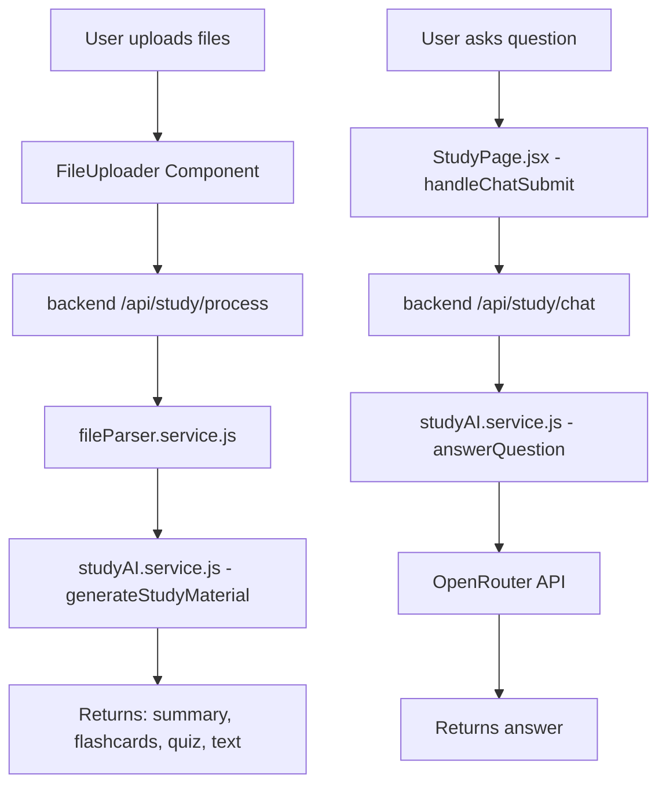

# Study Companion Query Feature - Fix Plan

## Executive Summary

The Study Companion's query/chat feature allows candidates to ask questions about uploaded study materials (PDF, TXT, etc.) and receive AI-generated answers based on the content. The feature is experiencing API connection errors.

## Current Architecture Analysis

### Existing Components



### Current Issues Identified

1. **In-Memory Session Storage** - `studySessions` Map gets cleared on server restart
2. **No Error Handling** - API fails silently without proper error messages
3. **Large Text Handling** - No chunking optimization for Q&A (unlike summary generation)
4. **No Persistence** - Study sessions not saved to database

---

## Detailed Fix Plan

### Phase 1: Backend Fixes

#### 1.1 Add Database Model for Study Sessions
**File:** `backend/models/StudySession.js` (new)

Create a MongoDB model to persist study sessions:
```javascript
{
  userId: ObjectId,
  sessionId: String,
  files: [{ name: String, text: String }],
  combinedText: String,
  summary: String,
  flashcards: Array,
  quiz: Array,
  chatHistory: [{ question: String, answer: String, timestamp: Date }],
  createdAt: Date,
  updatedAt: Date
}
```

#### 1.2 Update studyRoutes.js
**File:** `backend/routes/studyRoutes.js`

1. Import the new StudySession model
2. Replace in-memory Map with database operations
3. Add proper error handling middleware
4. Add input validation

#### 1.3 Enhance answerQuestion Function
**File:** `backend/services/studyAI.service.js`

1. Add text chunking for large documents (use existing chunkContent function)
2. Add better prompt engineering for Q&A
3. Add rate limiting
4. Add timeout handling

**Proposed Prompt Enhancement:**
```javascript
const prompt = `
You are an expert study assistant. Your task is to answer questions based ONLY on the provided study material.

STUDY MATERIAL:
"""
${chunkedText}
"""

QUESTION: ${question}

GUIDELINES:
- Answer ONLY based on the study material
- If the answer is not in the material, explicitly state "This information is not available in the uploaded study material."
- Cite specific sections when possible
- Be concise and educational
- Use bullet points for complex answers
`;
```

### Phase 2: Frontend Enhancements

#### 2.1 Improve Error Handling in StudyPage.jsx
**File:** `frontend/src/pages/StudyPage.jsx`

1. Add detailed error messages from backend
2. Show loading states more clearly
3. Add retry mechanism for failed requests
4. Add connection status indicator

#### 2.2 Enhance Chat UI
**File:** `frontend/src/pages/StudyPage.jsx`

1. Add typing indicator while waiting for response
2. Auto-scroll to latest message
3. Add character count for questions
4. Add "Clear Chat" functionality

### Phase 3: Testing & Validation

#### 3.1 API Testing Checklist
- [ ] Test chat with small text (< 5000 chars)
- [ ] Test chat with large text (> 10000 chars)
- [ ] Test with PDF content
- [ ] Test with TXT content
- [ ] Test error scenarios (empty question, no study material)
- [ ] Test session persistence across server restarts

---

## Implementation Steps

### Step 1: Create StudySession Model
- [ ] Create `backend/models/StudySession.js`
- [ ] Define schema with all required fields
- [ ] Add indexes for efficient querying

### Step 2: Update studyRoutes.js
- [ ] Import StudySession model
- [ ] Modify `/api/study/process` to save to database
- [ ] Modify `/api/study/chat` to use database
- [ ] Add proper error handling

### Step 3: Enhance studyAI.service.js
- [ ] Optimize answerQuestion with text chunking
- [ ] Improve prompt for better answers
- [ ] Add timeout handling

### Step 4: Update Frontend
- [ ] Improve error handling in StudyPage.jsx
- [ ] Add better loading states
- [ ] Test end-to-end flow

---

## Technical Considerations

### Text Chunking for Q&A
The existing `chunkContent` function in studyAI.service.js can be reused:
- For Q&A, chunk to smaller sizes (8000 chars) for better context
- Use overlap to maintain context continuity

### API Rate Limiting
Consider adding:
- Rate limit per user (e.g., 10 questions per minute)
- Queue system for heavy loads

### Fallback Mechanisms
If OpenRouter fails:
1. Return user-friendly error message
2. Suggest retrying with shorter questions
3. Offer to generate a new summary instead

---

## Expected Outcome

After implementing this plan:
1.  Candidates can ask unlimited questions about their study materials
2.  Sessions persist across server restarts
3.  Better error messages guide users
4.  Faster response times with optimized text handling
5.  Full chat history available for review

---

## Files to Modify

| File | Action |
|------|--------|
| `backend/models/StudySession.js` | Create (new) |
| `backend/routes/studyRoutes.js` | Modify |
| `backend/services/studyAI.service.js` | Modify |
| `frontend/src/pages/StudyPage.jsx` | Modify |

---

## Questions for Clarification

1. Should chat history be persisted and viewable later?
2. Should there be a limit on questions per session?
3. Should the system support multiple uploaded files in a single chat context?
