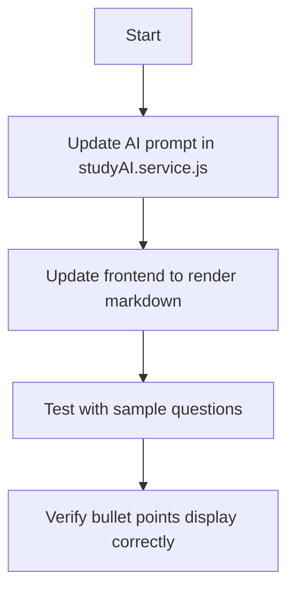

# Plan: Fix Study Companion Response Formatting

## Problem Statement

The AI-generated answers in the Study Companion chat feature are not properly formatted. 

**Current Output Example:**
```
Q: which all features we have under this project ?
A: **Features Overview** - **Voice-Enabled AI Mock Interviewer** - **GitHub Repository Analysis** - **CodeX Sandbox** - **AI Study Companion** - **Resume Analyzer**
```

**Expected Output:**
- Title should be bold
- Rest of content should be normal font
- Answers should be in bullet points

---

## Root Cause Analysis

The issue has two parts:

### 1. Backend - AI Prompt Not Enforcing Format (Primary Issue)
In [`backend/services/studyAI.service.js`](backend/services/studyAI.service.js:331), the `answerQuestion` function has loose formatting instructions:
```javascript
Instructions:
- Use **bold** for headings/titles
- Use bullet points (-) for all lists
- Structure answers with clear sections - EXAMPLE: **Feature Name** - Description line 1 - Description line 2
```

The AI is interpreting this loosely, putting everything on one line with dashes.

### 2. Frontend - Plain Text Rendering (Secondary Issue)
In [`frontend/src/pages/StudyPage.jsx`](frontend/src/pages/StudyPage.jsx:179), chat answers are rendered as plain text:
```jsx
<div className="text-gray-600 mt-1">A: {msg.answer}</div>
```

The summary already uses [`ReactMarkdown`](frontend/src/pages/StudyPage.jsx:140) to render markdown - same should be applied to chat answers.

---

## Solution Plan

### Step 1: Strengthen Backend AI Prompt

**File:** [`backend/services/studyAI.service.js`](backend/services/studyAI.service.js:331)

Modify the `answerQuestion` function prompt to strictly enforce markdown formatting:

```markdown
STRICT FORMATTING RULES:
1. First line MUST be a bold heading using **Heading Text**
2. Every bullet point MUST be on its own line starting with -
3. NO inline dashes or semicolons connecting items
4. After the heading, all content must be bullet points

CORRECT EXAMPLE:
**Features Overview**
- Voice-Enabled AI Mock Interviewer
- GitHub Repository Analysis
- CodeX Sandbox
- AI Study Companion
- Resume Analyzer

INCORRECT (DO NOT USE):
**Features Overview** - **Voice-Enabled AI Mock Interviewer** - ...
```

### Step 2: Update Frontend to Render Markdown

**File:** [`frontend/src/pages/StudyPage.jsx`](frontend/src/pages/StudyPage.jsx:174)

Change the chat message rendering to use ReactMarkdown:

```jsx
{/* Before */}
<div className="text-gray-600 mt-1">A: {msg.answer}</div>

{/* After */}
<div className="text-gray-600 mt-1 prose prose-sm max-w-none">
  <ReactMarkdown remarkPlugins={[remarkGfm]}>
    {msg.answer}
  </ReactMarkdown>
</div>
```

Add styling for proper bullet point display:
- Bullet points should have proper indentation
- Bold text in bullets should render correctly

---

## Files to Modify

| File | Changes |
|------|---------|
| `backend/services/studyAI.service.js` | Update prompt in `answerQuestion()` function |
| `frontend/src/pages/StudyPage.jsx` | Use ReactMarkdown to render chat answers |

---

## Implementation Sequence



---

## Expected Result

After implementation, the output should look like:

```
Q: which all features we have under this project ?

A:
**Features Overview**
- Voice-Enabled AI Mock Interviewer
- GitHub Repository Analysis  
- CodeX Sandbox
- AI Study Companion
- Resume Analyzer
```

---

## Questions for Clarification

1. Should the implementation also handle numbered lists or only bullet points?
2. Are there any other AI features (like Codex, GitHub Analysis) that have similar formatting issues?
