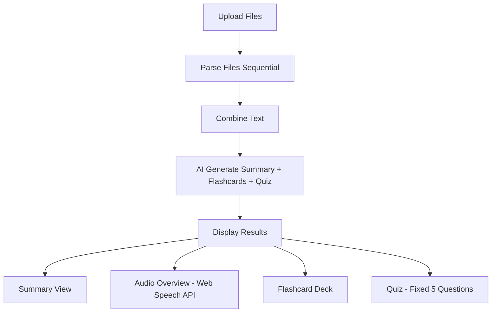
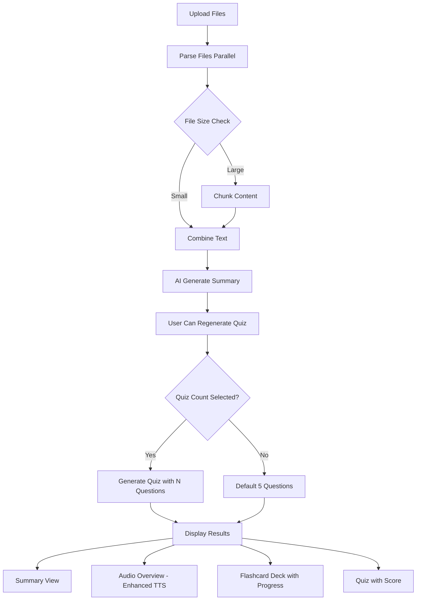

# Study Companion Improvement Plan

## Overview

This plan addresses four key issues with the Study Companion feature:

1. **File processing is slow and markdown output is suboptimal**
2. **Audio Overview sounds robotic**
3. **Flashcards are not working correctly**
4. **Quiz section needs user-configurable question count**

---

## Issue 1: Optimize File Processing & Markdown Generation

### Root Causes

- Files are processed sequentially instead of in parallel
- AI prompt has a 14K character limit which truncates content
- No chunking strategy for large documents

### Solution

#### Backend Changes

**File: `backend/routes/studyRoutes.js`**
- Convert sequential file parsing to parallel processing using `Promise.all()`
- Add file size validation and optimization
- Implement chunking for large files (>50KB)

**File: `backend/services/fileParser.service.js`**
- Add OCR support for scanned PDFs using Tesseract.js
- Implement better text extraction with content-aware parsing
- Add support for DOCX files
- Add caching for previously parsed files

**File: `backend/services/studyAI.service.js`**
- Increase context window handling with content chunking
- Improve markdown prompt to generate cleaner bullet-point structure
- Add summarization before detailed processing for large texts
- Implement streaming response for better UX

---

## Issue 2: Make Audio Overview Less Robotic

### Root Causes

- Uses browser's native Web Speech API (SpeechSynthesis)
- Limited voice options
- No prosody control (intonation, emphasis)

### Solution

#### Option A: Enhanced Browser TTS (Frontend)

**File: `frontend/src/components/study/AudioPodcastPlayer.jsx`**
- Add voice selection dropdown with multiple voice options
- Implement SSML (Speech Synthesis Markup Language) for better prosody
- Add speed/rate control slider
- Add pitch control
- Implement paragraph-based pausing for natural speech
- Cache generated audio for replay

**Voice Enhancement:**
- Use Amazon Polly or Google Cloud TTS via backend API
- Add pre-processing to split text into sentences with appropriate pauses

#### Option B: Backend Audio Generation (Recommended)

**New File: `backend/services/audio.service.js`**
- Integrate with ElevenLabs or similar API for natural-sounding audio
- Generate audio files server-side
- Return audio URL for playback

**Frontend Changes:**
- Update AudioPodcastPlayer to play pre-generated audio files
- Add loading state while generating audio
- Implement audio download feature

---

## Issue 3: Fix Flashcards Not Working

### Root Causes

- Flashcard data structure mismatch between backend and frontend
- No validation for empty flashcard arrays
- Frontend FlashcardDeck doesn't handle empty/undefined cards gracefully

### Solution

#### Backend Changes

**File: `backend/services/studyAI.service.js`**
- Add explicit validation that flashcards are generated from document content
- Increase minimum flashcards to 10
- Add instruction to generate concept-based questions, not just definitions

#### Frontend Changes

**File: `frontend/src/components/study/FlashcardDeck.jsx`**
- Add null/empty check for cards array
- Add error message display when no flashcards available
- Add card counter (e.g., "Card 3 of 10")
- Add shuffle functionality
- Add progress indicator

**File: `frontend/src/pages/StudyPage.jsx`**
- Add loading state for flashcards
- Handle case when flashcards are missing from response

---

## Issue 4: Quiz Section - User Selectable Question Count

### Root Causes

- Quiz generates fixed 5 questions
- No option to customize quiz length
- No way to regenerate quiz after initial generation

### Solution

#### Frontend Changes

**File: `frontend/src/components/study/QuizMode.jsx`**
- Add quiz settings panel with:
  - Number input/dropdown (5, 10, 15, 20 questions)
  - "Generate Quiz" button
- Add loading state during generation
- Add quiz progress indicator
- Add score summary at the end

**New API Endpoint: `POST /api/study/quiz`**
```javascript
// Request
{
  "text": "extracted text from resources",
  "count": 10  // number of questions requested
}

// Response
{
  "success": true,
  "quiz": [
    {
      "question": "...",
      "options": ["...", "...", "...", "..."],
      "correctAnswerIndex": 0
    }
  ]
}
```

**Backend Changes**

**File: `backend/routes/studyRoutes.js`**
- Add new endpoint `/api/study/quiz` for regenerating quiz with custom count
- Accept combined text from existing study session

**File: `backend/services/studyAI.service.js`**
- Add new function `generateQuiz(text, count)` that generates quiz with specified number of questions
- Update prompt to handle variable question counts

---

## Implementation Order

### Phase 1: Critical Fixes
1. Fix flashcard rendering issues
2. Add quiz count selection and regeneration

### Phase 2: Performance
3. Implement parallel file processing
4. Add content chunking for large files

### Phase 3: Quality Improvements
5. Enhance audio with voice options
6. Improve markdown generation quality
7. Add OCR support for scanned PDFs

---

## File Modifications Summary

| File | Changes |
|------|---------|
| `backend/routes/studyRoutes.js` | Add parallel processing, new quiz endpoint |
| `backend/services/studyAI.service.js` | Add quiz generation with custom count, improve prompts |
| `backend/services/fileParser.service.js` | Add DOCX support, OCR, caching |
| `frontend/src/pages/StudyPage.jsx` | Add quiz settings UI |
| `frontend/src/components/study/QuizMode.jsx` | Add count selector, regenerate button |
| `frontend/src/components/study/FlashcardDeck.jsx` | Add null checks, progress, shuffle |
| `frontend/src/components/study/AudioPodcastPlayer.jsx` | Add voice selection, controls |

---

## Mermaid: Current Flow



## Mermaid: Improved Flow



---

## Notes

- All changes are scoped to Study Companion only
- No modifications to other sections
- Backward compatibility maintained for existing API responses
- New quiz endpoint is optional - existing flow remains unchanged
