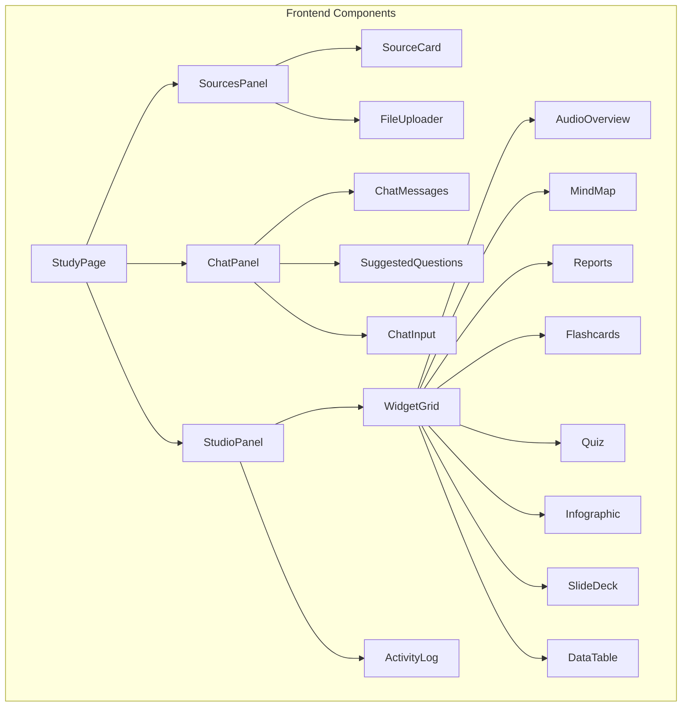

# Study Companion Dashboard - Three-Pane NotebookLM-Style Implementation Plan

## Overview

This plan outlines the complete redesign of the Study Companion feature to match the NotebookLM three-pane dark-themed interface.

### Current State Analysis

The existing implementation has:
- A 3-column layout with light theme (`bg-gray-50` / white backgrounds)
- Basic file uploader in left column
- Chat summary in center column
- Simple button list in right column
- Missing features: Source Guide cards, topic tags, document preview, suggested questions, 8-widget grid, activity log

### Target State

- Dark-themed interface (deep grays/blacks with subtle borders)
- Left Column: Source cards with Source Guide, topic tags, document preview
- Center Column: Interactive chat with formatted responses + suggested questions
- Right Column: 8-widget grid + Activity/History log
- Resizable/collapsible panes

---

## Architecture



---

## Implementation Steps

### Step 1: Create Dark Theme Layout Wrapper

**File:** `frontend/src/components/study/ThreePaneLayout.jsx` (NEW)

- Create a responsive three-column flex container
- Implement dark theme styles: `bg-[#0f0f0f]`, `border-[#2a2a2a]`
- Add resizable pane functionality using CSS flex or a library
- Include collapse/expand buttons for each column
- Default widths: Left 22%, Center flex-1, Right 24%

### Step 2: Create Source Card Component

**File:** `frontend/src/components/study/SourceCard.jsx` (NEW)

Design requirements:
- Card container with `bg-[#1a1a1a]` and `border-[#2a2a2a]`
- File name header with icon
- Source Guide section:
  - Summary text (expandable/collapsible)
  - Clickable topic tags at bottom (pill-style: `bg-[#2a2a2a] hover:bg-[#3a3a3a]`)
- Document preview:
  - Thumbnail view for PDFs/images
  - Scrollable text preview area
  - File type indicator badge

Props interface:
```typescript
interface SourceCardProps {
  fileName: string;
  summary: string;
  topics: string[];  // Topic tags
  previewUrl?: string;  // Document thumbnail
  onTopicClick?: (topic: string) => void;
  onRemove?: () => void;
}
```

### Step 3: Redesign Sources Panel

**File:** `frontend/src/components/study/SourcesPanel.jsx` (MODIFY)

- Wrap in dark theme container
- Integrate FileUploader component
- Display list of SourceCard components
- Add "Add Source" floating action button style
- Handle multiple uploaded files as cards

### Step 4: Create Suggested Questions Component

**File:** `frontend/src/components/study/SuggestedQuestions.jsx` (NEW)

- Horizontal scrollable pill menu
- Each pill is clickable and adds question to chat input
- Styling: `bg-[#2a2a2a] hover:bg-[#3a3a3a] text-gray-300`
- Generate suggestions from study topics or predefined questions

### Step 5: Redesign Chat Panel

**File:** `frontend/src/components/study/ChatPanel.jsx` (MODIFY)

- Dark theme: `bg-[#0f0f0f]`
- Dynamic header showing project name
- Chat message area with formatted responses:
  - Use ReactMarkdown for responses
  - Custom styling for headings, bold, bullets
  - User messages: right-aligned, `bg-[#2a2a2a]`
  - AI messages: left-aligned, `bg-[#1a1a1a]`
- Suggested Questions section (above input)
- Chat input with dark styling

### Step 6: Create Studio Widget Components

**File:** `frontend/src/components/study/StudioWidget.jsx` (NEW)

Create 8 widget components in a grid:

1. **AudioOverview** - Language selector dropdown + play button
2. **MindMap** - Interactive node-based visualization
3. **Reports** - Generate study reports
4. **Flashcards** - (existing component, integrate)
5. **Quiz** - (existing component, integrate)
6. **Infographic** - Generate visual summaries
7. **SlideDeck** - Create presentation slides
8. **DataTable** - Tabular data representation

Each widget:
- Icon (Lucide icons)
- Label
- Click to activate in center panel
- Grid: 2 columns

### Step 7: Create Activity Log Component

**File:** `frontend/src/components/study/ActivityLog.jsx` (NEW)

- List of background tasks
- Status indicators: pending (yellow), in-progress (blue), complete (green), failed (red)
- Timestamps for each activity
- "Clear history" button

### Step 8: Redesign Studio Panel

**File:** `frontend/src/components/study/StudioPanel.jsx` (MODIFY)

- Dark theme container
- Header: "Studio"
- Widget Grid (2x4)
- Activity Log section at bottom

### Step 9: Update Main StudyPage

**File:** `frontend/src/pages/StudyPage.jsx` (MODIFY)

- Replace light theme with dark theme wrapper
- Integrate new SourcesPanel, ChatPanel, StudioPanel
- Add state management for:
  - Current studio mode
  - Activity log items
  - Suggested questions

---

## File Changes Summary

| File | Action | Description |
|------|--------|-------------|
| `frontend/src/components/study/ThreePaneLayout.jsx` | NEW | Dark theme three-column layout wrapper |
| `frontend/src/components/study/SourceCard.jsx` | NEW | Source card with guide, tags, preview |
| `frontend/src/components/study/SuggestedQuestions.jsx` | NEW | Horizontal pill menu for suggestions |
| `frontend/src/components/study/StudioWidget.jsx` | NEW | Reusable widget component |
| `frontend/src/components/study/ActivityLog.jsx` | NEW | Background task history |
| `frontend/src/components/study/SourcesPanel.jsx` | MODIFY | Add dark theme, SourceCard list |
| `frontend/src/components/study/ChatPanel.jsx` | MODIFY | Add dark theme, suggested questions |
| `frontend/src/components/study/StudioPanel.jsx` | MODIFY | Add widget grid, activity log |
| `frontend/src/pages/StudyPage.jsx` | MODIFY | Use new components, dark theme |

---

## Color Palette

```css
/* Dark Theme */
--bg-primary: #0f0f0f;        /* Main background */
--bg-secondary: #1a1a1a;     /* Card backgrounds */
--bg-tertiary: #2a2a2a;      /* Hover states, inputs */
--border-color: #2a2a2a;     /* Subtle borders */
--border-light: #3a3a3a;     /* Lighter borders */
--text-primary: #ffffff;     /* Main text */
--text-secondary: #a0a0a0;   /* Secondary text */
--text-muted: #6b6b6b;       /* Muted text */
--accent-blue: #3b82f6;      /* Primary accent */
--accent-green: #22c55e;     /* Success */
--accent-yellow: #eab308;    /* Warning */
--accent-red: #ef4444;      /* Error */
```

---

## Responsive Behavior

- Desktop (≥1200px): All 3 columns visible
- Tablet (768-1199px): Left column collapsible, center + right visible
- Mobile (<768px): Single column with tab navigation between panes

---

## Component Props Reference

### ThreePaneLayout
```jsx
<ThreePaneLayout
  leftPanel={<SourcesPanel />}
  centerPanel={<ChatPanel />}
  rightPanel={<StudioPanel />}
  leftWidth={280}
  rightWidth={320}
  resizable={true}
/>
```

### SourceCard
```jsx
<SourceCard
  fileName="DELD_LAB_02.pdf"
  summary="This document explains data conversion techniques..."
  topics={["Binary Arithmetic", "Logic Gates", "Digital Converters"]}
  previewUrl="/path/to/thumbnail"
  onTopicClick={(topic) => handleTopicSelect(topic)}
  onRemove={() => removeSource()}
/>
```

### StudioWidget
```jsx
<StudioWidget
  icon={Headphones}
  label="Audio Overview"
  active={currentMode === 'audio'}
  onClick={() => setStudioMode('audio')}
/>
```

---

## Additional Implementation Recommendations

### 1. Source Card - Source Guide Logic

When building `SourceCard.jsx`:
- **Line-clamp effect**: Use CSS line-clamp (3-4 lines) with a 'Read More' toggle for the summary
- **Topic tags**: Style as small, low-contrast pills (`bg-[#2a2a2a]`) that highlight on hover (`bg-[#3a3a3a]`) to indicate they are interactive triggers for the chat

### 2. Three-Pane Layout

For `ThreePaneLayout.jsx`:
- **Library**: Use `react-resizable-panels` for pane resizing
- **Min-width**: Center column should have a minimum width of 500px to ensure chat remains readable while users expand Source or Studio panels
- Implement drag handles between panes

### 3. Studio Widget Grid

For the widget grid in `StudioPanel.jsx`:
- **Hover effect**: Use `hover:ring-1 hover:ring-blue-500` on widget cards
- **Badge**: For 'Audio Overview' widget, include a small 'New' or 'Pro' badge style to match the aesthetic

---

## Next Steps

1. Create all new component files
2. Modify existing components for dark theme
3. Test responsive behavior
4. Add keyboard navigation support
5. Consider adding drag-and-drop for pane resizing

---

## Technical Gotchas & Refinements

### 1. Context Management

Since the Source Card tags in the Left Panel and the Suggested Questions in the Center Panel both influence the Chat Input, you will need:

- **Solution**: Create a custom hook `useStudyChat` or React Context to manage the "Current Active Topic" across different components
- This ensures that clicking a topic tag in the Source Card auto-populates the chat input
- The context should manage: active topic, chat history, suggested questions, studio mode

### 2. Reading Mode for Previews

In Step 2 (SourceCard), when implementing the scrollable text preview:
- **Feature**: Support Search-in-Source (Ctrl+F) functionality
- **Implementation**: Use a content-editable div or textarea with find functionality
- **Use case**: Users often want to find the exact sentence the AI summarized in the Source Guide

---

## LLM Execution Prompt

When ready to start coding, use this instruction:

> "Using the provided 'Study Companion' implementation plan, generate the code for Step 1 (ThreePaneLayout) and Step 2 (SourceCard). Ensure the SourceCard component uses the #1a1a1a background and incorporates the topics array as interactive pills as specified in the Props Reference. Use Tailwind CSS for the styling."

---

## Notes

- All existing functionality (file upload, chat, flashcards, quiz, audio) must be preserved
- Dark theme should be consistent across all new components
- Use existing Lucide icons from the project
- Maintain backward compatibility with existing API endpoints
